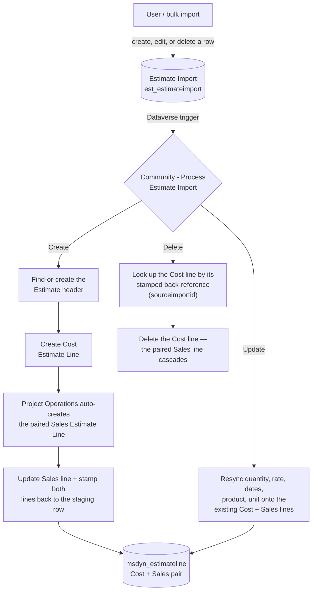

# D365 Project Operations — Estimate Import

A Dataverse solution that lets users **create or bulk-import project budget estimates** in Dynamics 365 Project Operations, automatically generating the paired **Cost** and **Sales** Estimate Line records that Project Operations requires.

## ⚠️ Known limitations (read before you rely on this)

- **Sales Estimate Line price may show 0.** Project Operations auto-creates the Sales line for every Cost line, and its own pricing engine recalculates `msdyn_price`/`msdyn_amount` from the project's **sales price list** on every write. If your project has no price list configured, PO resets that field to 0 regardless of what you entered. `est_salerate` on the staging row is the authoritative rate for reporting — either treat it as the source of truth, or configure a sales price list on your project if you need Project Operations' own field to show a real number.
- **Editing only a lookup field won't re-trigger processing.** The Dataverse trigger excludes lookup columns from its change-filter (a Microsoft/Dataverse connector limitation, not a choice made here) so the flow's own write-backs don't loop forever. Practically: if you change *only* the Product or Task on an already-processed row, the Update branch won't fire on its own — change any scalar field (quantity, rate, description, dates) alongside it.
- **Solution Checker will flag `flow-avoid-recursive-loop` (Medium) on the write-back actions.** This is a false positive it can't fully verify statically — the flow does write back to its own trigger table, but the trigger's `filteringattributes` explicitly excludes every field the flow writes (`est_processingstatus`, `est_processingnotes`, `est_costestimateline`, `est_saleestimateline`), so it never re-triggers itself. Confirmed with real test runs, not just code review. Safe to ignore.
- **How Delete actually finds the lines to remove.** Dataverse's Delete trigger for this connector doesn't expose the deleted row's other field values, so the flow can't read its stored Cost/Sales line lookups at delete time. Instead, every Cost Estimate Line is stamped with a back-reference (`est_sourceimportid`, a custom field on the standard `msdyn_estimateline` table) when it's created, and the Delete branch looks the line up by that stamp. Verified end-to-end — deleting a staging row deletes its paired lines. If a Cost line's stamp is ever missing for some reason (e.g. it was created some other way than through this flow), deleting its staging row is a harmless no-op rather than an error.
- **Not auto-wired into your app's navigation.** See [Installation step 4](#installation) — you'll add it to your model-driven app's sitemap yourself (a two-minute job in App Designer) or use a direct URL.

See [HOW_TO_USE.md](HOW_TO_USE.md) for a full usage walkthrough with these limitations explained in context.

## Why this exists

Project Operations' standard `msdyn_estimateline` table requires **two linked records per business "line"** — a Cost line and a Sales line, paired via `msdyn_PairedSalesLine`. The standard Excel/data-import tools have no concept of this pairing, so importing a list of estimate lines the normal way is not possible without manually creating and linking pairs one at a time.

This solution adds a simple **staging table** (`est_estimateimport`) with a friendly Quick Create form and views, plus a **Power Automate flow** that watches it and does the Cost/Sales pairing work automatically — including reacting to edits and deletes, not just creation.

## Architecture



The staging table never touches `msdyn_estimateline` directly for reads after the pair exists — the flow is the only writer, and every optional lookup (Task, Resource Category, Product, Transaction Category, Unit) flows through untouched when left blank rather than blocking the Create.

## What's included

- **Custom table**: `est_estimateimport` ("Estimate Import") — the staging/input table, with lookups to Project, Project Task, Resource Category, Unit, Product, and Transaction Category (all optional except Project, matching what standard Project Operations allows).
- **Forms**: Quick Create + Main form, styled to match the standard Estimate quick-create experience. Both include a small JavaScript web resource (`est_/js/estimate_import_task_filter.js`) that filters the Project Task lookup to only show tasks belonging to the Project you've selected — picking Project first, then Task, is enforced rather than left to the user to get right. There's also a Quick View form (read-only summary panel) for embedding this record on other entities' forms.
- **Views**: Active / Inactive / My / Advanced Find / Associated / Lookup / Quick Find, all showing the relevant columns where applicable.
- **Security role**: `Estimate Import User (Community)` — grants exactly the privileges needed to use this table (own-table CRUD, read access to the lookup target tables, append rights to the generated Estimate/Estimate Line records). Rename it after import if you like; it's just a starting point.
- **Power Automate flow**: `Community - Process Estimate Import` — triggers on Create, Update, and Delete of a staging row:
  - **Create**: finds-or-creates the parent Estimate header for the project, creates the Cost Estimate Line, and updates the Sales Estimate Line that Project Operations auto-creates for it (PO does not allow creating that one explicitly).
  - **Update**: if the row was already processed, pushes changed values (quantity, rate, dates, product, description, unit) onto the existing paired lines instead of creating new ones.
  - **Delete**: deletes the paired Cost + Sales Estimate Lines when the staging row is deleted.
  - Every optional field (Task, Resource Category, Product, Transaction Category) is genuinely optional end-to-end — a missing value is simply omitted, never blocks processing, matching how standard Project Operations treats these fields.

## Prerequisites

This is **not** a generic Dataverse solution — it depends on standard Project Operations tables and will fail to import without them. Dataverse enforces these as real import-time dependencies, not just documentation:

| Requirement | Why it's needed |
|---|---|
| **Dynamics 365 Project Operations** (built/tested against 4.170.3509.4) | Provides Project, Project Task, Estimate, and Estimate Line — the tables this solution pairs Cost/Sales lines against. |
| **Universal Resource Scheduling** (`msdynce_Scheduling`) | Provides Bookable Resource Category, used by the Resource Category lookup. |
| **Product Management** (`msdynce_ProductManagement`) | Provides Product and Unit (UoM), used by the Product and Unit lookups. |

In practice you don't need to install these separately — they're baseline components of any working Project Operations deployment (they're what standard Estimate Lines already run on internally). If your environment already lets you create a normal Estimate Line with a Product, Unit, and Resource Category, you have everything this solution needs. A bare/trial Dataverse environment without Project Operations does not qualify.

- System Administrator (or equivalent solution-import) access to import the solution.
- [Power Platform CLI](https://aka.ms/PowerPlatformCLI) if you want to import via CLI, or use the Power Platform admin center / maker portal.
- A Power Automate license/capacity that covers the **Dataverse connector** (Premium tier) for the flow — normally already covered by your Dynamics 365 licensing.

## Installation

1. **Import the solution**
   - Recommended: import `solution/EstimateImportCommunity_managed.zip` via the [Power Platform admin center](https://admin.powerplatform.microsoft.com) → your environment → Solutions → Import, or:
     ```
     pac auth create --url https://<your-org>.crm.dynamics.com
     pac solution import --path solution/EstimateImportCommunity_managed.zip --publish-changes
     ```
   - If you want to customize the solution further, import the unmanaged version instead (`EstimateImportCommunity_unmanaged.zip`), or build from `solution/src` (see [Building from source](#building-from-source)).

2. **Reconnect the flow's Dataverse connection and turn it on**
   The flow ships **off by default** — Power Automate connection references are environment-specific, so it can't run until you reconnect one anyway. After import, open **Community - Process Estimate Import** in Power Automate, reconnect the Dataverse connection reference, and turn the flow **On**.

   > If the import log shows a warning under "Workflow Activation" mentioning a missing parameter like `item/est_sourceimportid`, ignore it — it's a known, harmless timing issue (the Dataverse connector's schema cache for the new custom field can lag a minute or two behind the metadata import within the same solution transaction). The flow, table, and field all still import correctly; you just turn the flow on manually in this step regardless, which sidesteps it entirely.

3. **Assign the security role**
   Assign the `Estimate Import User (Community)` security role to any user who should be able to create/manage Estimate Import rows.

4. **Add the table to your app's navigation (optional)**
   Automated sitemap injection for this table wasn't reliably scriptable via CLI at build time, so the table may not appear in your Project Operations app's left navigation out of the box. Either:
   - Add `Estimate Import` (`est_estimateimport`) to your app's sitemap manually via the App Designer, or
   - Navigate directly via URL: `https://<your-org>.crm.dynamics.com/main.aspx?appid=<your-app-id>&pagetype=entitylist&etn=est_estimateimport`

5. **Try it out** — see [HOW_TO_USE.md](HOW_TO_USE.md) for a full walkthrough.

## Field reference

| Field | Type | Target / Notes |
|---|---|---|
| `est_name` | Text | Line name (primary field) |
| `est_project` | Lookup | `msdyn_project` — required |
| `est_projecttask` | Lookup | `msdyn_projecttask` — optional |
| `est_resourcecategory` | Lookup | `bookableresourcecategory` — optional, recommended when Transaction Classification = Time |
| `est_transactionclassification` | Choice | Time / Expense / Material / Milestone / Fee / Retainer |
| `est_transactioncategory` | Lookup | `msdyn_transactioncategory` — optional, recommended when Transaction Classification = Expense |
| `est_product` | Lookup | `product` — optional, catalog product |
| `est_writeinproductname` | Text | Optional, used when no catalog product applies |
| `est_uom` | Lookup | `uom` (Unit) — optional |
| `est_quantity` | Decimal | |
| `est_startdate` / `est_enddate` | DateTime | |
| `est_costpricelistname` / `est_salespricelistname` | Text | Reference/reporting only |
| `est_costrate` / `est_salerate` | Money | Authoritative rate for reporting — see [Known limitations](#-known-limitations-read-before-you-rely-on-this) |
| `est_description` | Memo | |
| `est_processingstatus` | Choice | New / Processing / Processed / Error |
| `est_processingnotes` | Memo | Diagnostic output from the flow (validation notes, error details) |
| `est_costestimateline` / `est_saleestimateline` | Lookup | `msdyn_estimateline` — set automatically by the flow, link back to the generated pair |

## Building from source

The unpacked solution source lives in `solution/src` (standard Dataverse solution XML format, `pac solution unpack` output). To build your own zip after making changes:

```
pac solution pack --zipfile ./MySolution.zip --folder ./solution/src --packagetype Unmanaged
pac solution import --path ./MySolution.zip --publish-changes
```

## Contributing

Issues and pull requests are welcome — this was built to solve a real gap in Project Operations' standard tooling, and improvements (a proper price-list-aware Sales line update, a more complete sitemap solution, additional validation) are very welcome.

## License

MIT — see [LICENSE](LICENSE).
